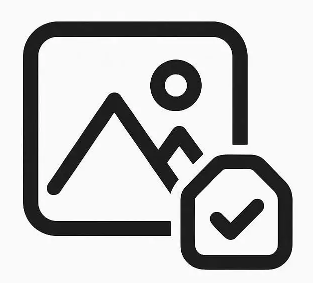
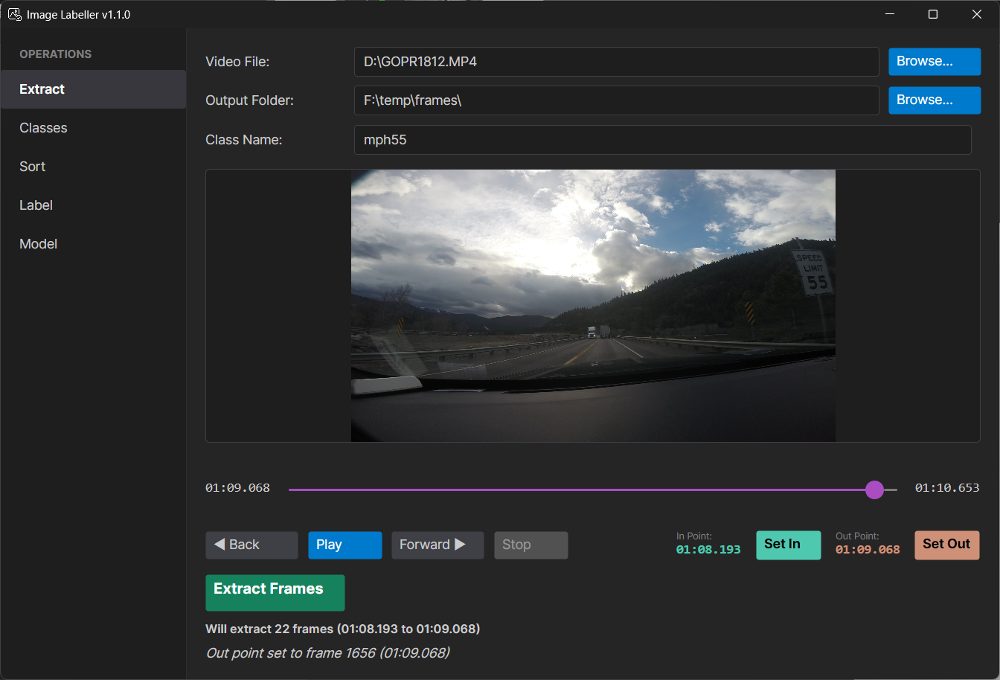
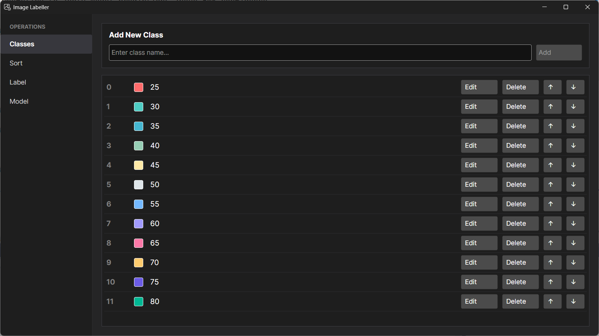
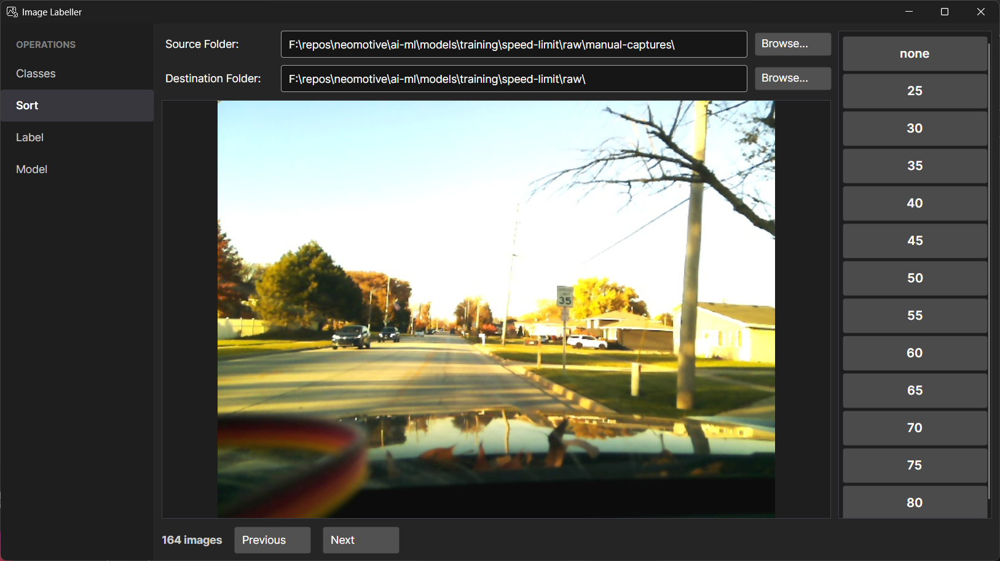
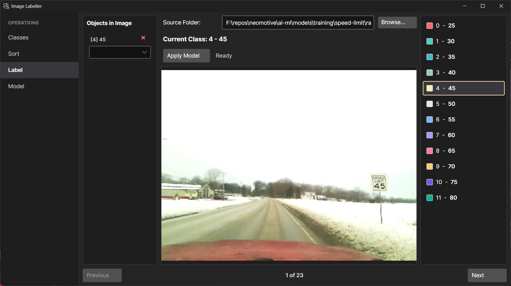

<div align="center">
  

  # ImageLabeller

  ### A simple, intuitive tool for image labeling and sorting

  [](https://dotnet.microsoft.com/)
  [](https://avaloniaui.net/)
  [](LICENSE)
</div>

---

## Why ImageLabeller?

Let's be honest - most image labeling software out there is **massive**, **confusing**, and often requires you to create an account just to get started. They're packed with features you'll never use, have steep learning curves, and can be a real pain to set up.

**ImageLabeller is different.** It's lightweight, straightforward, and gets out of your way so you can focus on what matters: labeling your images. No accounts, no subscriptions, no bloat. Just download it and start working.

Oh, and it's completely **free and open source**.

## What Can It Do?

ImageLabeller is built for **single-user workflows** and handles the most common tasks you need for ML image datasets:

### 🏷️ **Classes Management**
- Define your object classes (car, person, dog, etc.)
- Easy-to-use interface for adding, editing, and removing classes
- Each class gets a unique color for visual distinction
- Export/import your class definitions

### Video Frame Extraction
- Quickly view MP4 video files
- Set in and out points for extraction
- Define a class name to prefix your frame images
- Click a button to extract frames

### 📂 **Image Sorting**
- Quickly sort images into class-specific folders
- Navigate through images with keyboard shortcuts (number keys + arrow keys)
- Perfect for initial dataset organization
- See how many images you've sorted at a glance

### 🎯 **Bounding Box Labeling**
- Draw bounding boxes around objects in your images
- Change object classes on the fly with a dropdown
- Delete annotations with a single click
- Full keyboard support for faster workflows
- Zoom and pan to get precise annotations
- YOLO format output (ready for training!)

### 🤖 **AI-Assisted Auto-Labeling**
- Load your ONNX models to help with labeling
- Auto-detect objects with confidence scores
- One-click to apply model predictions above 50% confidence
- Test your models on new images before deploying

## Screenshots

### Video frame extraction:

### Edit your classes:

### Sort your images

### Label your images (auto-label with your own model if you have one!)

### Test your model


## Getting Started

### Prerequisites
- **Windows**, **macOS**, or **Linux** (cross-platform!)
- **.NET 8.0 Runtime** or SDK

### Installation

1. **Clone the repository:**
   ```bash
   git clone https://github.com/yourusername/ImageLabeller.git
   cd ImageLabeller
   ```

2. **Build the project:**
   ```bash
   cd Source/ImageLabeller
   dotnet build
   ```

3. **Run it:**
   ```bash
   dotnet run
   ```

Or just grab a pre-built release from the [Releases](../../releases) page!

## How to Use

### 1. Define Your Classes
Start by defining the object classes you want to label (e.g., "car", "person", "bike"). Each class gets assigned a color automatically.

### 2. Sort Your Images (Optional)
If you have a bunch of unsorted images, use the **Sort** view to quickly categorize them into folders. Just browse to your source folder, and press number keys to move images into class-specific folders.

### 3. Label with Bounding Boxes
Switch to the **Label** view to draw bounding boxes around objects:
- **Click and drag** to draw a box
- **Press number keys** (0-9) to select different classes
- **Left/Right arrows** to navigate between images
- **Delete key** to remove selected annotations
- **Ctrl + Mouse wheel** to zoom in/out

All annotations are saved in YOLO format (`.txt` files next to your images).

### 4. Test Your Models (Optional)
Got an ONNX model? Load it in the **Model** view to:
- See what your model detects in test images
- Verify confidence scores before deploying
- Use the **Apply Model** button in Label view for AI-assisted labeling

## Tech Stack

Built with modern, cross-platform technologies:

- **[.NET 8.0](https://dotnet.microsoft.com/)** - The foundation
- **[Avalonia UI](https://avaloniaui.net/)** - Beautiful, cross-platform UI framework
- **[Microsoft.ML.OnnxRuntime](https://onnxruntime.ai/)** - Run your ML models
- **[SixLabors.ImageSharp](https://sixlabors.com/products/imagesharp/)** - Image processing

## Keyboard Shortcuts

| Key | Action |
|-----|--------|
| `0-9` | Select class by number |
| `←` / `→` | Previous/Next image |
| `Delete` | Delete selected annotation |
| `Ctrl` + `Wheel` | Zoom in/out |

## YOLO Format

All bounding box annotations are saved in YOLO format:
```
<class_id> <center_x> <center_y> <width> <height>
```

Where coordinates are normalized (0-1) relative to image dimensions. Perfect for training with YOLOv5, YOLOv8, and similar frameworks!

## Contributing

Found a bug? Have a feature idea? Contributions are welcome!

1. Fork the repo
2. Create a feature branch (`git checkout -b feature/amazing-feature`)
3. Commit your changes (`git commit -m 'Add amazing feature'`)
4. Push to the branch (`git push origin feature/amazing-feature`)
5. Open a Pull Request

## License

This project is licensed under the MIT License - see the [LICENSE](LICENSE) file for details.
